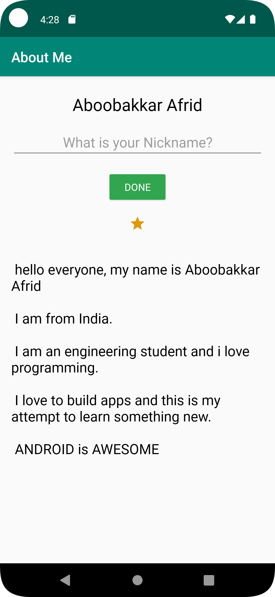
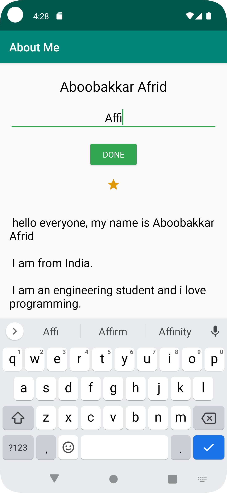
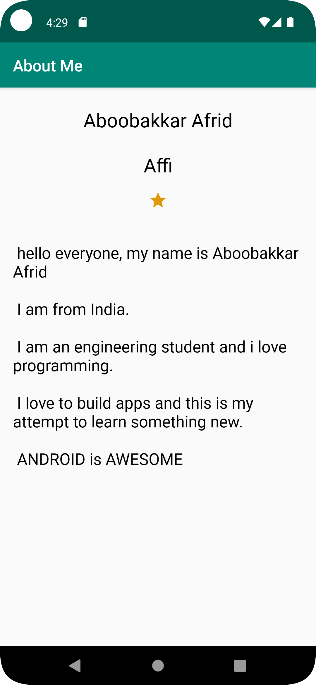

# Android About Me App
<h2>Contents</h2>

This is a basic android app containing 
1. EditText that takes in user name and once the name is entered the edit text is hidden and the name is displayed in a textview
1. ImageView that displays an icon
1. A textview containing about me contents and content is loaded from string resource file


## Installation
Clone this repository and import into **Android Studio**
```bash
git clone https://github.com/affi1504/About_me_app.git
```

<h3>Building by downloading .zip and using Android Studio...</h3>

1. Dowload the .zip file by clicking *Code* -> Download ZIP
1. Extract the .zip file
1. Open Android Studio
1. select *Open*
1. Select the **About_me_ap** directory.
1. Ensure the Project gets build and in case the IDE asks to sync *click* **Sync Now**.
1. Run the App using a Physical device or Emulator

# Screenshots
[](screenshots/Screenshot_1.png)

[](screenshots/Screenshot_2.png)

[](screenshots/Screenshot_3.png)
